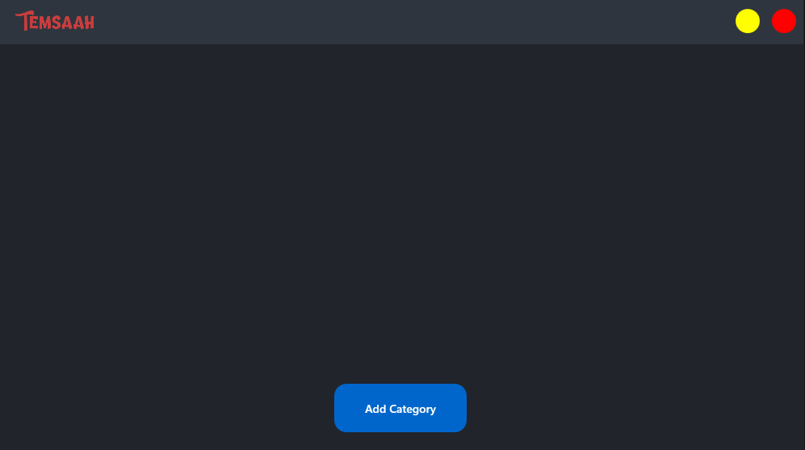

# 🎮 **GameBundler**

**GameBundler** is a tool designed to save gamers time by managing third-party applications associated with their games. 

## 🎯 **Overview**

As gamers, we often use various third-party tools and applications alongside our games. Whether it's voice chat, performance monitoring, or game-enhancing apps, launching each one individually can be time-consuming and tedious.

**GameBundler** aims to streamline this process. With just one click, **GameBundler** will launch all the third-party apps associated with your game, letting you focus on gaming.

## 🌟 **Features**

- **One-Click Launch**: Open all your gaming-related apps at once with just a single click.
- **Custom Associations**: Associate specific third-party apps with each of your games for personalized automation.
- **Time-Saving**: Spend less time setting up and more time gaming.

## 🚀 **Getting Started**

**GameBundler** is designed to be user-friendly and easy to use. Here's a quick guide on how to use it:

-  **Add a Category**: Click on the `Add Category` button to create a new category.

- **Add Files to a Category**: You have the option to add files to it. These files represent the third-party applications associated with your game.

-  **Launch a Category**: After adding files to a category, you can launch all the associated applications at once by clicking on the `Launch Category` button.

-  **Stop a Category**: Once a category is launched, a `Stop Category` button will appear. Clicking this button will close all the applications that were launched with the category.
    

With **GameBundler**, you can create multiple categories, each with its own set of associated applications. This allows you to have different sets of applications for different games or gaming scenarios.
